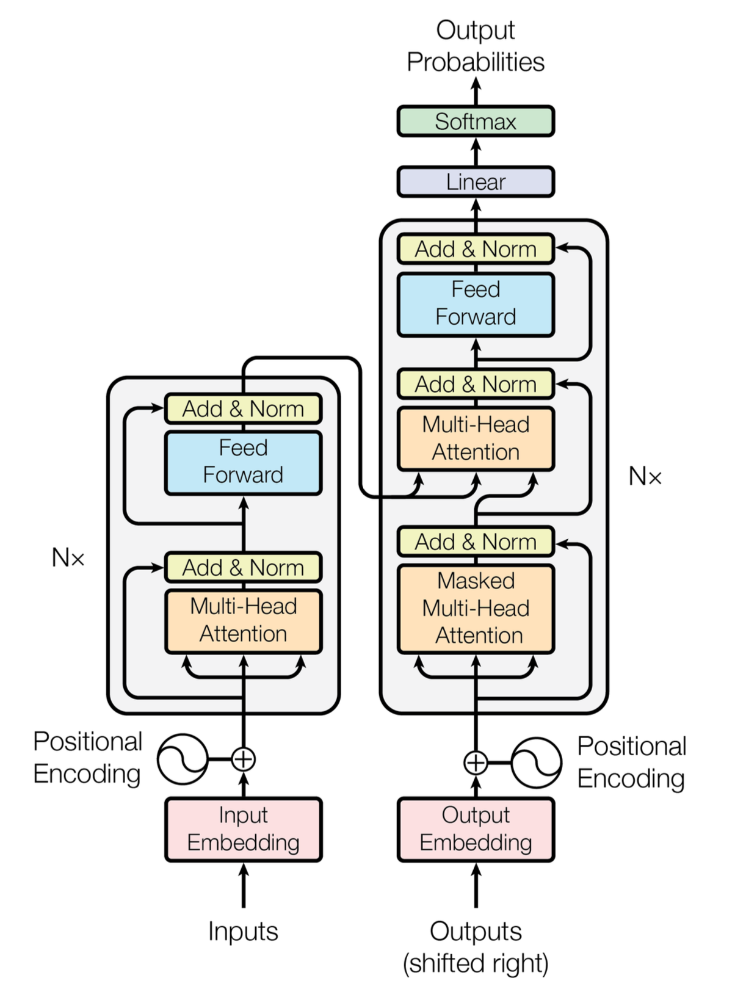

# Introduction
This is a continuation of my previous series, [learning_makemore](https://github.com/tesla1900/learning_makemore), where I follow lectures of [Andrej Kaparthy](https://www.youtube.com/playlist?list=PLAqhIrjkxbuWI23v9cThsA9GvCAUhRvKZ) and build a Generative Pre-training Transformer (GPT) from scratch. In this project, we build a character-level language model using the Transformer architecture, inspired by the model powering systems like ChatGPT. We implement the transformer based model from the paper "Attention Is All You Need" paper (Vaswani et al., 2017).  While ChatGPT is a bigger model trained on vast internet data, this project uses the much smaller dataset - all the works of Shakespeare. The goal isn't to replicate ChatGPT, but to understand the Transformer neural network by building a simplified version, nanoGPT.

We start with data preparation, including tokenization (converting text characters into numerical sequences) and splitting data into train/validation sets to monitor overfitting. We establish a baseline using a simple Bigram model before diving into the Transformer's core: the Self-Attention mechanism. The established baseline is the following: 

```
step 0: train loss 4.7305, val loss 4.7241
step 300: train loss 4.3818, val loss 4.3896
step 600: train loss 4.0801, val loss 4.0784
step 900: train loss 3.8066, val loss 3.8117
step 1200: train loss 3.5844, val loss 3.5850
step 1500: train loss 3.3757, val loss 3.3829
step 1800: train loss 3.2182, val loss 3.2218
step 2100: train loss 3.0817, val loss 3.0810
step 2400: train loss 2.9663, val loss 2.9739
step 2700: train loss 2.8809, val loss 2.8800
step 3000: train loss 2.7984, val loss 2.8055
step 3300: train loss 2.7461, val loss 2.7386
step 3600: train loss 2.6850, val loss 2.7032
step 3900: train loss 2.6580, val loss 2.6647
step 4200: train loss 2.6236, val loss 2.6301
step 4500: train loss 2.5917, val loss 2.5941
step 4800: train loss 2.5686, val loss 2.5781

Foasth prse -bEchaPistRel
O u fZWie hy:


Y:k, COI teg aggellly rr Mkecowor chad ge?ofeO,vre thakeD hPayo in mppry way av he oubT:$zDusickes bokthaNAl-hiNCL:

O, ?w el fe? gaise fre lbustselow!'dcus;
I m w
T:
TIONTRFly m hEUjurks,Singn itheLa!
's oe, ogimyFREQ?, bad gient&ofBimatey &y cDWeer'dsuq-isold arrayf

INCy ckn?wim mu!
Itho mzmybalorenyongmy!orord Vofatthindy st
HBfqqUMy, mave alsteanerm zo, oupomp!
Whe d pre h, gaXESYgin Thean apsts lathindKIO:
Bero, wQk IOLUEDWd ngKVjeic'd Fe.F n IV:
Y
```

The self-attention mechanism allows tokens in a sequence to dynamically weigh the importance of other tokens when forming their representation. Key concepts introduced include:
* Query, Key, and Value vectors: Each token generates these vectors to determine what information it's looking for (Query), what information it holds (Key), and what information it will share (Value).
* Scaled Dot-Product Attention: Affinities between tokens are calculated using dot products between Queries and Keys, scaled to stabilize training. A softmax function converts these affinities into weights.
* Masking: In decoder models (like GPT and this project), future tokens are masked out to prevent the model from "cheating" during training.
* Multi-Head Attention: Running multiple attention mechanisms ("heads") in parallel allows the model to focus on different types of information simultaneously.
* Positional Encoding: Since attention itself doesn't inherently understand sequence order, positional information is explicitly added to token embeddings.

Building upon self-attention, the full Transformer block incorporates additional crucial elements. FeedForward Networks are applied independently to each token's representation after attention, allowing for further computation. Residual Connections (skip connections) are added around both the attention and feedforward layers, enabling gradients to flow more easily through deep networks, significantly improving training stability. Layer Normalization is applied (typically before the main transformations in modern implementations - "pre-norm") to stabilize the activations within each layer. Regularization techniques like Dropout are also introduced to prevent overfitting, especially as the model scales. These components (Multi-Head Attention, FeedForward, Residual Connections, LayerNorm) form a "block" which is stacked multiple times (n_layer) to create the deep Transformer network as shown below. 

 

Finally, we scale up the model's hyperparameters (embedding size n_embd, number of layers n_layer, number of heads n_head, context length block_size) and train it on a RTX 3090 GPU. While the resulting model generates Shakespeare-like text, it highlights the vast difference in scale and training compared to state-of-the-art models like GPT-3 (175B+ parameters trained on trillions of tokens vs. our ~10M parameter model trained on ~1M characters). Furthermore, achieving ChatGPT's conversational ability requires extensive additional stages beyond this initial pre-training, including supervised fine-tuning on instruction-following data and complex Reinforcement Learning from Human Feedback (RLHF) to align the model with user intent. We leave that easy task for future projects.

Output of 10M parameter model (check out [generated.txt](generated.txt) for 10k character output. 
```
10.788929 M parameters 
step 0: train loss 4.2846, val loss 4.2820 
step 500: train loss 1.8935, val loss 2.0082
step 1000: train loss 1.5323, val loss 1.7204
step 1500: train loss 1.3901, val loss 1.6002 
step 2000: train loss 1.3043, val loss 1.5434 
step 2500: train loss 1.2495, val loss 1.5220 
step 3000: train loss 1.2001, val loss 1.4974 
step 3500: train loss 1.1578, val loss 1.4798 
step 4000: train loss 1.1200, val loss 1.4778 
step 4500: train loss 1.0836, val loss 1.4777

Thy wrong davour sail, i' the commons:
Come that is no office I to be gentle climary, And am thurns there, I'll even to fall thee To lose you.
FLORIZEL:
Come Anrichmony that:
There is hot were sufformers banish comment,
That fear'd my well-heart.
I shall not be tempested town;
But that,
let honourable perpillars. For I,
And Messenger, thee-unting of opposition botterness
Shall stand bapest you city.
Clown:
Haply man! He told Hermingst the mords! applahs and yeb:
More are answer'd face withith
```


